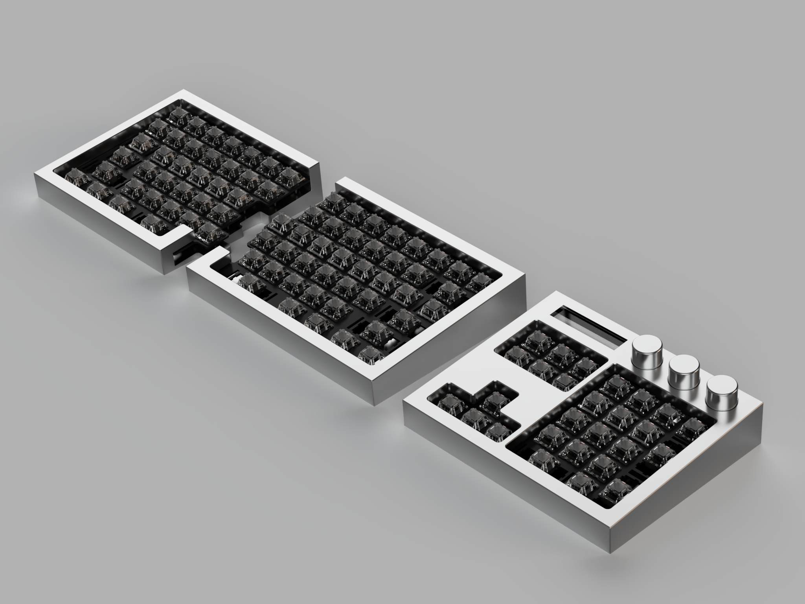

  <h1>dsk</h1>
  

    <strong>The developer's split keyboard.</strong>

  

    
  

  

    
    
  

    The Developer's Split Keyboard (dsk) is an open-source, ergonomic, and customizable keyboard for developers.

### About

dsk is a modular split keyboard built for developers, offering both ergonomic flexibility and a traditional typing experience. It consists of:

- dsk: A split keyboard that can be used separately for ergonomic comfort or joined for a standard layout.
- dsk-pad: A multilayer macropad with three rotary encoders, navigation, arrow keys, numpad, and an OLED display for additional functionality.

### Design Philosophy

The **dsk** project is built around the following core principles:

- **Ergonomic Yet Familiar**: dsk is designed to be ergonomic and comfortable for long typing sessions, while still maintaining a familiar layout for developers.
- **Compact But Complete**: dsk should minimize the footprint on your desk while providing all the keys you need for development (F-keys, navigation, arrow keys, etc.).
- **Modular and Customizable**: dsk is designed to be modular, breaking down into smaller components that can be placed in different configurations to suit your needs.
- **Simple and Accessible**: dsk is designed to be easy to manufacture, assemble, and program, using off-the-shelf components, established open standards, and open-source firmware.

### Manufacturing

> [!NOTE]  
> This project is still in development and manufacturing details and documentation will be added soon!

dsk can be easily made using additive methods (3D printing, resin, SLS) or CNC milling. Full details at [dsk.twango.dev/docs](https://dsk.twango.dev/docs).

> [!TIP]
> Students and educators commonly have access to 3D printers and CNC machines through their institutions! Check with your school or local makerspace for more information.

